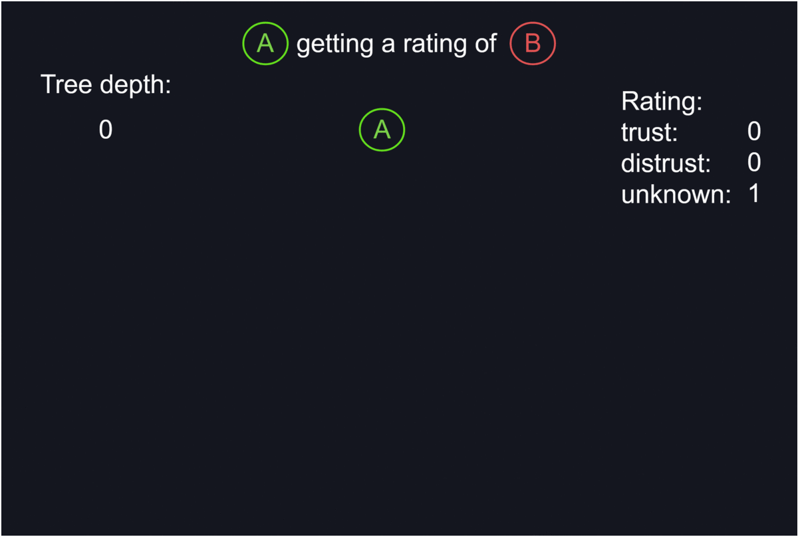

# TIC - Trusted IOTA Contacts
A simple library providing a secure way to validate identities in the IOTA network.

With TIC you can publish information which you want to share about yourself on the tangle and publish that you trust or
distrust the information of someone else. The ones you trust are your 'contacts'. With this a Web of Trust is established 
by which you can validate the information of someone by accumulating the trust ratings of your contacts and their contacts 
and so on. This makes it possible to derive a trust rating for someone who is not your direct contact.

[__Try out the web example__](https://cdn.rawgit.com/cr0ssing/tic.api.js/9c2372c/examples/web/)

# Usage
## Installation
Install node/npm. Then run:
```sh
$ git clone git@github.com:cr0ssing/tic.api.js.git
$ cd tic.api.js
$ npm install
```

## As a CLI
You can use all functions of the TIC library with a simple CLI. The releases contain binaries for different platforms with
that you can use TIC standalone from the command line:
```sh
$ ticCli-linux-x86 <command> [options]
```
It's also possible to run the cli directly with node/npm:
```sh
$ cd tic.api.js
$ npm run cli <command> -- [options]
```
Note the extra '--' needed before the options.

You can use TIC globally if you link it with npm:
```sh
$ cd tic.api.js
$ npm link
$ tic <command> [options]
```

Take a look at the [CLI Reference](docs/cli.md) to learn about the available commands.

## As a library
TIC is a library for node.js. Using it is as easy as:
```js
const tic = require('tic.api.js')
```

Read the [API Reference](docs/api.md) to learn more.

* * *
# How it works
TIC uses MAM channels to store your "Account Information" on the tangle. The root of your profile and your contacts channel are stored on your public "master channel". If you want, you can store the seeds of these channels on the restricted channel, where your set password is used as the channel's sideKey.


When you query the trust rating of a TIC account from your own TIC Account, all your declared contacts are queried. Next their contacts are queried. These repeats until a given depth. For every visited contact TIC looks for a rating for the Account you want to rate. The accumulated ratings are returned as the result of the rating query.



* * *

&copy; 2018 Robin Lamberti \<lamberti.robin@gmail.com\>.
